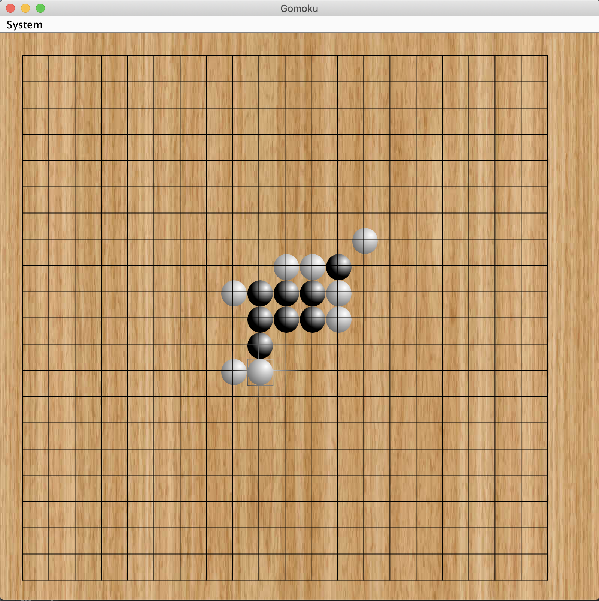

# Gomoku

## Introduction
A simple two players Gomoku game. The rule follows the well-known official Gomoku rule.
If one player firstly manages to form five pieces in a line vertically, horizontally, or diagonally, 
then this player is the winner. Players can restart the game, go back one step, or quit the game by 
clicking the "System" button on the upper left corner of the panel. 

## Screenshot

##Reference

https://github.com/ecraya14/Gomoku  
https://blog.csdn.net/cnlht/article/details/8176130
https://stackoverflow.com/questions/4312391/board-game-win-situation-searching-algorithm